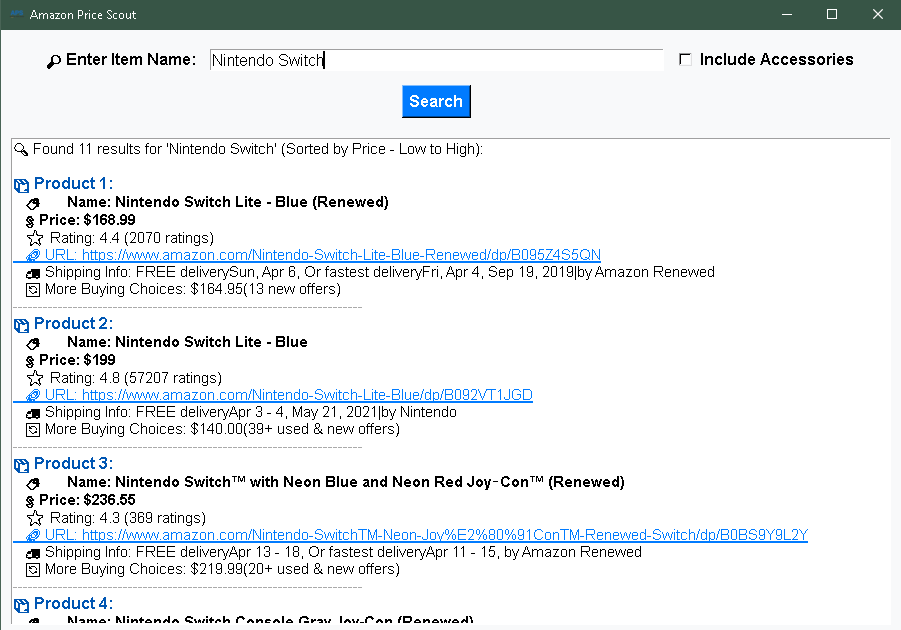

# Amazon Price Scout

**Amazon Price Scout** is a simple tool designed to help users track prices for products listed on Amazon. It allows users to input an item name and returns a list of products that match the search criteria. It also includes sorting by price (low to high) and provides a direct link to the product page for easy purchase.
<br>
*Screenshot*:
<br>

<br>
### Features
  * **Search Amazon**: Users can search for products based on an item name.
  * **Price Filtering**: Excludes unwanted product categories like cables, controllers, etc.
  * **Sorted Results**: Displays product results sorted by price, from low to high.
  * **Clickable Links**: Direct links to product pages are provided for easy access.
  * **Background Music**: Relaxing background music is played while using the application.
  
### Installation

1. **Clone this repository** to your local machine:

```bash
git clone https://github.com/yourusername/Amazon-Price-Scout.git
```
```bash
cd Amazon-Price-Scout
```

2. Install dependencies using the requirements.txt:
```bash
pip install -r requirements.txt
```

3. Run the program:

```bash
python main.py
```
### Contact
Creator: Kenneth Gauthier aka oxy
Email: oxycaution@gmail.com

### License
This project is licensed under the MIT License - see the LICENSE file for details.
Feel free to modify and distribute the project as per the license terms.
---

***ENJOY!***
